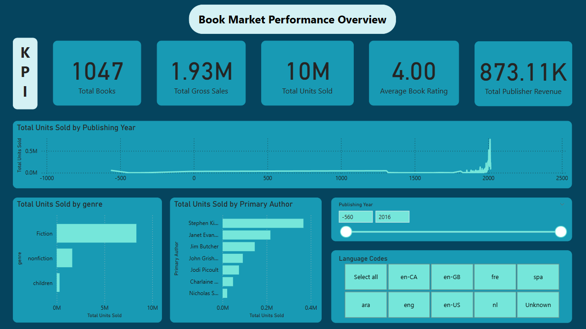
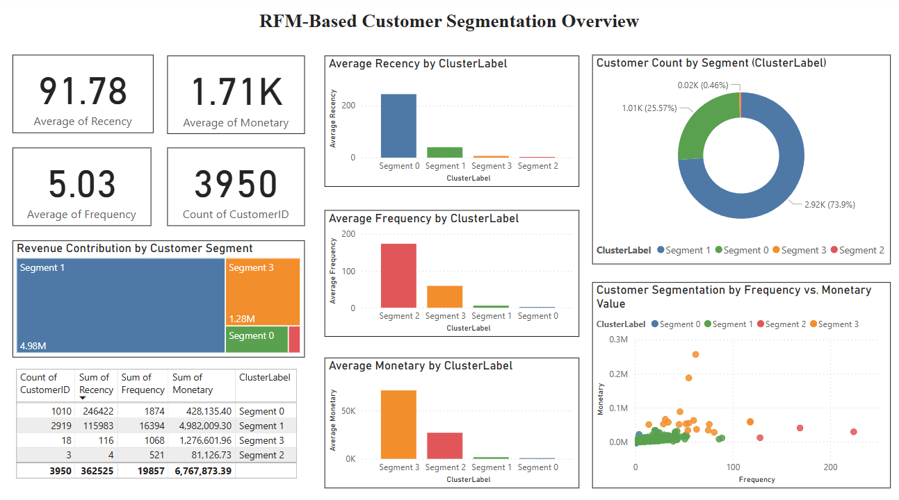
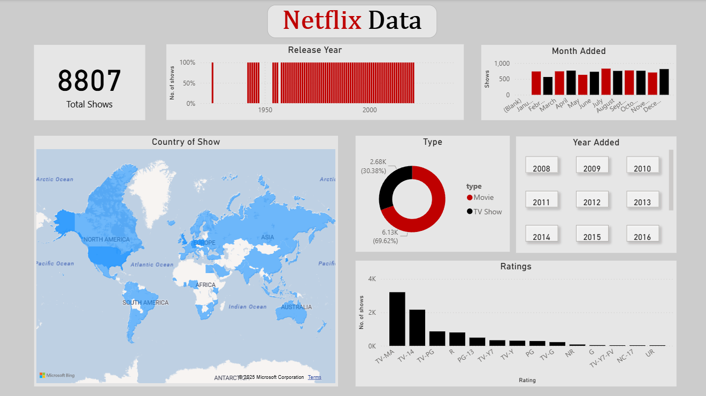
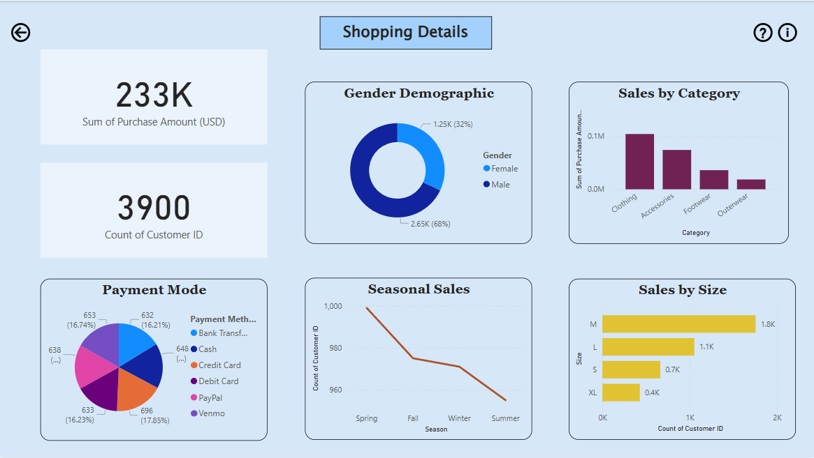

# Power BI Dashboards

This repository showcases a collection of interactive Power BI dashboards I've developed, demonstrating my skills in data visualization, business intelligence, and data analysis. Each dashboard aims to transform complex datasets into actionable insights, providing a clear and engaging way to understand key trends and performance metrics.

---

## About This Repository

In this repository, you'll find:

- **Diverse Dashboard Examples:** A variety of dashboards covering different industries, datasets, and analytical focuses.
- **Interactive Visualizations:** Each dashboard is designed to be interactive, allowing users to drill down into data and explore insights.
- **Problem-Solving Focus:** Every dashboard addresses a specific business question or analytical challenge.

## How to View the Dashboards

To interact with these dashboards:

- **Download the `.pbix` Files:** The easiest way to explore the dashboards is to download the individual `.pbix` files from their respective folders. You'll need **Power BI Desktop** installed on your computer to open and interact with them.
  - [Download Power BI Desktop](https://powerbi.microsoft.com/desktop/)

---

## Dashboard Collection & Explanations

### 1. Book Market Performance Overview
**File:** `book_market_performance.pbix`  
**Image Preview:**  

This dashboard analyzes the **book publishing market**, focusing on **sales performance**, **genre trends**, and **top-selling authors**.

#### Key Insights:
- **1047 Books** analyzed with **10M+ units sold** and **1.93M gross sales**
- **Genre Dominance:** Fiction books significantly outperform nonfiction and children's books.
- **Author Analysis:** Stephen King leads in sales volume among all authors.
- **Time Series:** Visualizes book sales by **publishing year** from ancient texts to the 21st century.
- **Language Code Filters:** Interactive slicer to filter performance by language (e.g., en-US, spa, fre).

> *Use Case:* For publishers or marketers aiming to track content trends, optimize catalogs, and plan promotions.

---

### 2. RFM-Based Customer Segmentation Overview  
**File:** `cust_seg.pbix`  
**Image Preview:**  

This dashboard segments customers using the **RFM (Recency, Frequency, Monetary)** model to understand customer value and retention behavior.

#### Key Insights:
- **3,950 customers** clustered into **4 segments** using RFM logic.
- **Segment 1** is the most valuable, generating **$4.98M** in revenue.
- Visualization of average **recency**, **frequency**, and **monetary value** per cluster.
- Pie chart shows **majority (74%) of customers fall in Segment 1**, which are highly active and recent.
- Scatter plot analysis between frequency and monetary value reveals outliers and high-value targets.

> *Use Case:* Ideal for marketing teams seeking to identify loyal customers and design targeted engagement campaigns.

---

### 3. Netflix Content Analysis Dashboard  
**File:** `netflix.pbix`  
**Image Preview:**  

An analytical breakdown of **Netflix's content catalog**, focusing on release patterns, content types, countries of origin, and rating distribution.

#### Key Insights:
- Total of **8,807 titles**, categorized into **Movies (30%)** and **TV Shows (70%)**
- Release trends from early 1900s to recent years
- **Country-wise distribution** of shows via an interactive map
- Popular ratings like **TV-MA, TV-14**, and **TV-PG** dominate the catalog
- Breakdown of content added by **month and year**

> *Use Case:* Content strategists or analysts can use this to evaluate platform diversity, growth in content offerings, and regional expansion.

---

### 4. Shopping Behavior & Sales Analysis  
**File:** `shopping.pbix`  
**Image Preview:**  

This dashboard examines **e-commerce customer behavior**, focusing on gender, size, category preferences, and seasonal purchasing trends.

#### Key Insights:
- **Revenue:** $233K in total purchases from **3,900 customers**
- **Demographics:** Males contribute to **68%** of purchases
- **Top Categories:** Clothing and accessories lead in purchase volume
- **Size Preference:** Medium (M) size is the most sold
- **Seasonal Trend:** Spring has the highest customer count
- **Payment Methods:** Diverse modes like PayPal, Credit Card, Venmo, etc.

> *Use Case:* E-commerce analysts or business owners can use this to enhance product targeting and improve seasonal marketing.

---

## Technologies Used

- **Microsoft Power BI Desktop:** For data modeling, transformation (Power Query), and visualization.
- **DAX (Data Analysis Expressions):** For creating custom measures and calculated columns.
- **Various Data Sources:** Including Excel, CSV, SQL databases, etc. (mention specific types if you frequently use them).

---

## Get in Touch

I'm always open to feedback and collaboration! If you have any questions or would like to discuss any of the dashboards, feel free to:

- **Open an issue** in this repository.
- **Connect with me on LinkedIn:** https://www.linkedin.com/in/aditi-agr/
- **Email me:** aditi786aaa@gmail.com

---
